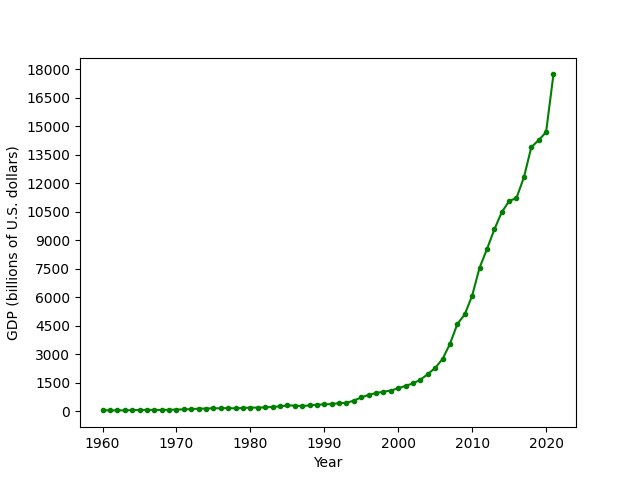
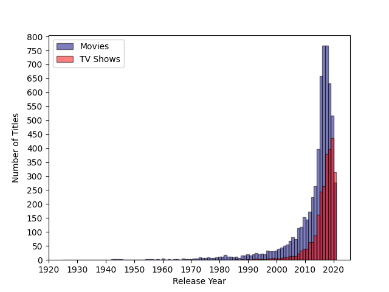

# Visualizing interesting datasets

In this project, I will be performing a data visualization on two different datasets: 
* One in JSON (JavaScript Object Notation) format
* One in CVS (comma-separated values) format

Here is a link to the project instructions: [Project_02](https://github.com/mikeizbicki/cmc-csci040/tree/2022fall/project_02)
 
  
   
## China's GDP From 1960 to 2021

This data was downloaded from [awesome-json-datasets](https://github.com/jdorfman/awesome-json-datasets#gdp). Thank you to @jdorfman for putting together such an awesome list of JSON datasets!

## Number of Titles (Movies and TV Shows) Available on Netflix by Release Year

